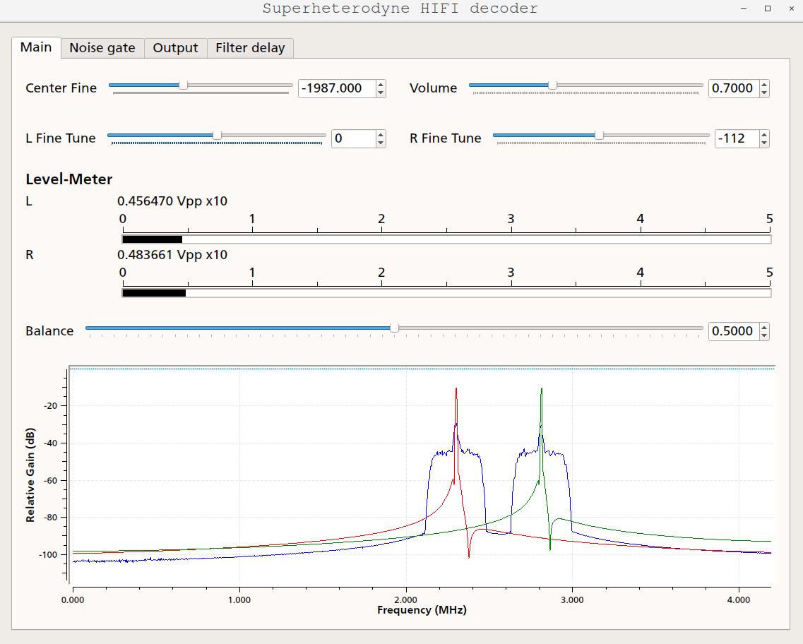
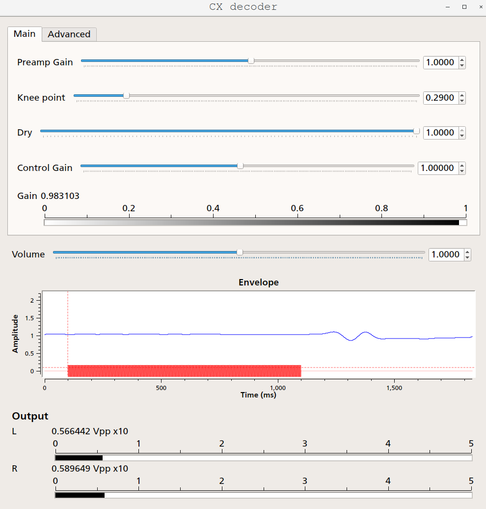

# Superheterodyne decoding tools
A set of tools to decode RF audio and video signals present on LaserDiscs and/or VTRs/VHSs

# LD-HiFi analogue audio decoder

This tool takes the raw ADC capture from the [Domesday Duplicator](https://www.domesday86.com/?page_id=978) and/or the [CXADC](https://github.com/happycube/cxadc-linux3),
demodulates the analog FM carriers, and then translates it into a 16bit 192kHz sample rate audio .wav file.

Additionally it has a prototype of the CX noise reduction decoder interpreted from a 1982 Popular Electronics article and translated into GNU Radio

Both the demodulator, and the CX expander runs near realtime on my setup.
(About 8 seconds per 5 seconds of 40MSPS capture file)

## Audio demodulator GUI

## Audio CX decoder prototype

## Requirements

GNU Radio + Python 3 (tested with gnuradio-companion 3.8.1.0 (Python 3.6.9))

ld-ldf-reader from [ld-decode](https://github.com/happycube/ld-decode)

[gr-pipe](https://github.com/jolivain/gr-pipe) (recommended)

## How to use (from a pre-recorded image):

1) Convert the .oga format into raw r16 with ld-ldf-reader 

example: 

$ ld-ldf-reader NASA_optics.ldf > NASA_optics.r16

And enable the file source 

Or download the [gr-pipe](https://github.com/jolivain/gr-pipe) module for gnuradio to decode on the fly directly from the .oga / .ldf image

2) Open/edit the [Audio demodulator](/grc/LD-HiFi_decoder.grc) in gnuradio-companion
3) Open/edit the [CX decoder](/grc/CX_decoder.grc) 

4) Configure the input sample rate (samp_rate) and or/ the carrier frequencies on the variables on top of the flowgraph.
The current FM carriers are set for **NTSC LaserDisc images**

For other formats (PAL), change the L_carrier_ref and R_carrier_ref variables with the
frequency in MHz of the analog carrier of interest.

Both graphs (demodulator + decoder) are connected with a ZMQ pipe, it needs TCP port 5555 available on localhost.

## Demodulation notes

For best results adjust both "L carrier fine" and "R carrier fine" to match 
the carrier peaks for that particular recording.
Save them as defaults in carrierL_fine and carrierR_fine "Default Value" on the
QT GUI Range 
 
Save the flowgraph with the new defaults and execute again.

All the controls adjustments will be recorded while decoding (if you move them while running)
The EQ curve (de-emphasis) is not stable yet

If you close the demodulator, you will need to restart the CX decoder too.

Using the gr-pipe might hang the demodulator when the GUI is closed. 
Kill the ld-ldf-reader process first to avoid that.

## Output comparision

The demodulator produces a "demodulated_hifi.wav"

The CX decoder produces a "CX_decoded_output.wav"

## VCR/VHS and related

See /grc folder, still experimental 

