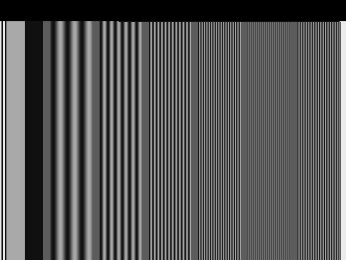

Based on:
https://web.archive.org/web/20141031003122/http://www1.tek.com/Measurement/cgi-bin/framed.pl?Document=%2FMeasurement%2FApp_Notes%2FNTSC_Video_Msmt%2Fvideotesting2.html

Generates standard multiburst test chart for VTR testing (no PCM adaptor DC equalization pulses)
```
$ python3 multiburst_generator.py -w 70 -b 10 -d 1 -s 4 -o multiburst.bmp
```

Generates multiburst test chart for VTR testing (with PCM adaptor DC equalization pulses)
```
$ python3 multiburst_generator.py -s 4 -o multiburstPCM.bmp
```

Don't use the -l parameter (not stable yet)\
Use the scale factor -s instead to get a bigger resolution chart\
Once the chart is scaled to the target resolution all the burst frequencies should be on spec.

```

$ python3 multiburst_generator.py --help

usage: multiburst_generator.py [-h] [-l [LINES]] [-s [SCALE]] [-d [DEVICE]]
                               [-c [COLOR]] [-a [ASPECT]] [-w [WHITE]]
                               [-b [BLACK]] [-o [OUTPUT]]

Generates multiburst testing charts for video bandwidth testing

optional arguments:
  -h, --help            show this help message and exit
  -l [LINES], --lines [LINES]
                        lines per frame (default 525)
  -s [SCALE], --scale [SCALE]
                        scale of the output image (default 1)
  -d [DEVICE], --device [DEVICE]
                        target device -> 0: VTR, 1: CRT monitor (default 0)
  -c [COLOR], --color [COLOR]
                        color pattern -> 0: grayscale, 1: red, 2: blue
                        (default 0)
  -a [ASPECT], --aspect [ASPECT]
                        aspect ratio (default 1.333333 [4:3])
  -w [WHITE], --white [WHITE]
                        white clip level (default 70 IRE)
  -b [BLACK], --black [BLACK]
                        black clip level (default 10 IRE)
  -o [OUTPUT], --output [OUTPUT]
                        write to file (default, None)
```

